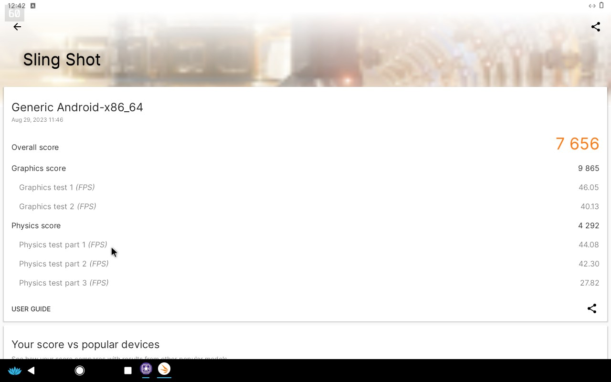
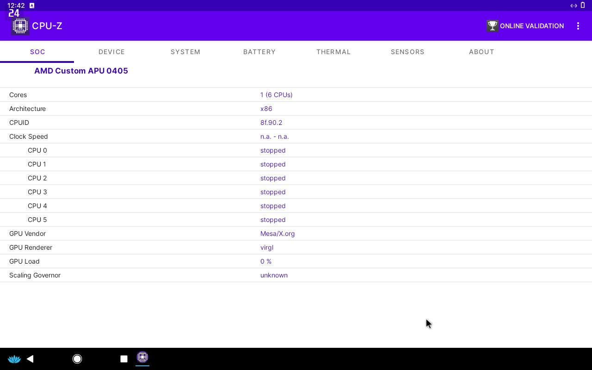

# Android-x86 on appimage

Technically this isn't really a single appimage (yet) since I'm still figuring out how to correctly make an appimage including the necessary packages (qemu, etc). If someone can teach, teach me pls

My motivation for this project is really to play android games on my steam deck so this will focus on running there. 

This emulator is currently based on Android-x86 (currently Bliss-OS 14) via QEMU.

# Settings things up

Your directory should contain these 5 files.

```
./
├── data.qcow2  --- you'll need to generate your own, see steps below
├── initrd.img  --- taken from bliss-os 14
├── kernel      --- taken from bliss-os 14
├── os.img      --- generated from bliss-os 14 or see releases
├── qemu-system-x86_64-x86_64.AppImage
└── run.sh
```

## Steps
- Clone this repo for the qemu appimage and run.sh
- Download os.img, kernel and initrd.img [here](https://github.com/ccvelandres/android-x86-steamdeck/releases) OR create your own using whatever image you want
- Generate data.qcow2 (see steps below)
- Run `run.sh` and it should work&trade;

## Making the data image

The data.img is where your files, games will be placed (internal storage of the emulator). I'm only sharing the instructions and not an already made one. (I hate to accidentaly share my image with my files in it).

```
# This steps is for bliss-os, if you use other image, read their documentation
# You'll probably need root here for nbd
# For larger storage size, just change 40G to whatever size you want

qemu-img create -f qcow2 data.qcow2 40G
modprobe nbd
qemu-nbd -c /dev/nbd0 data.qcow2
parted /dev/nbd0 mktable msdos mkpart p ext4 0% 100% q
mkfs.ext4 /dev/nbd0p1
mkdir -p mnt
mount /dev/nbd0p1 mnt
truncate -s 40G mnt/data.img
mkfs.ext4 -F -b 4096 mnt/data.img
umount mnt
qemu-nbd -d /dev/nbd0

# Save the data.qcow2 file for later, that's the file we want
```

## Grabbing the boot files from bliss-os

I used this image [Bliss OS v14](https://sourceforge.net/projects/blissos-dev/files/Beta/Bliss-v14.10-x86_64-OFFICIAL-opengapps-20230325.iso/download). Recent release of bliss-os seems to be missing libhoudini so check the changelogs if you use a different release.


```
qemu-img create -f raw os.img 8G
parted os.img mktable msdos mkpart p ext4 0% 100% q
losetup --partscan --show --find os.img
mkfs.ext4 /dev/loop0p1
mkdir mnt
mount /dev/loop0p1 mnt
mkdir mnt/android/data

losetup --partscan --show --find Bliss-v14.10-x86_64-OFFICIAL-opengapps-20230325.iso
mkdir ref
mount /dev/loop1p1 ref

# os.img should contain kernel,initrd.img and system.sfs
# this version doesn't have a separate ramdisk.img
cp -t mnt/android ref/kernel ref/initrd.img ref/system.sfs

# Save the kernel and initrd.img, we'll need it for booting via qemu
cp -t . ref/kernel ref/initrd.img

umount ref
losetup -d /dev/loop1
```

## Performance

Some issue I encounter on some games is low gpu usage. I get ~10fps on some games with the gpu sitting at ~4% 200Mhz. No idea how to fix that.

Benchmarks:




# References

The appimage is really from https://github.com/yui0/berry-os, I just stripped out the other files since I have no idea how to make an appimage, teach me pls